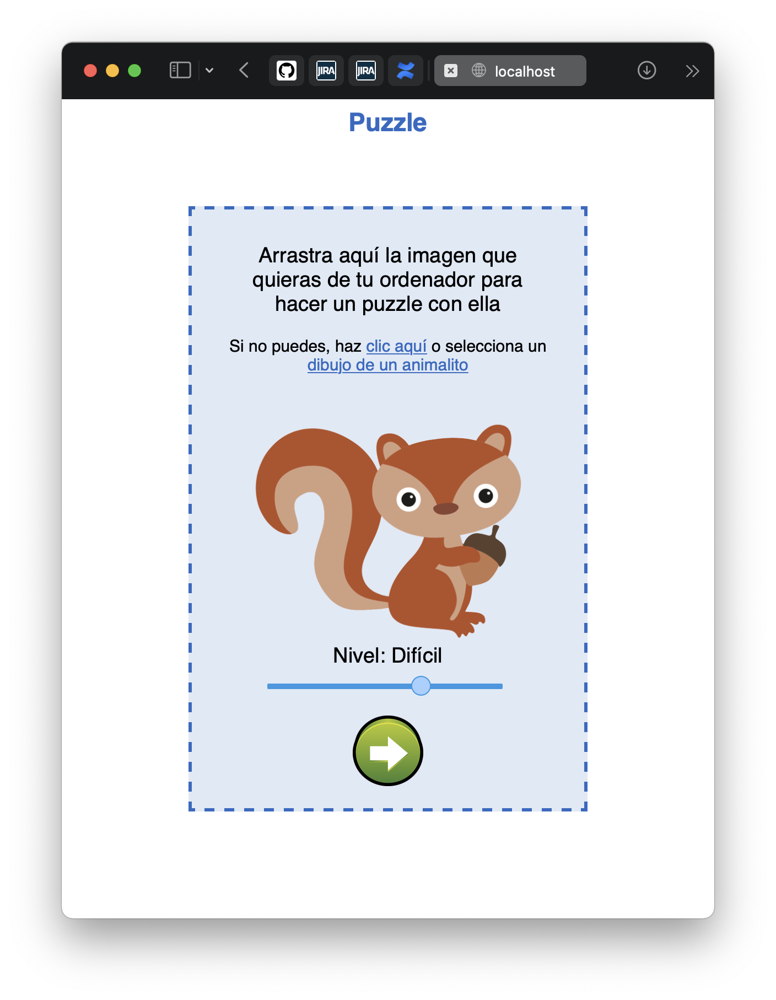
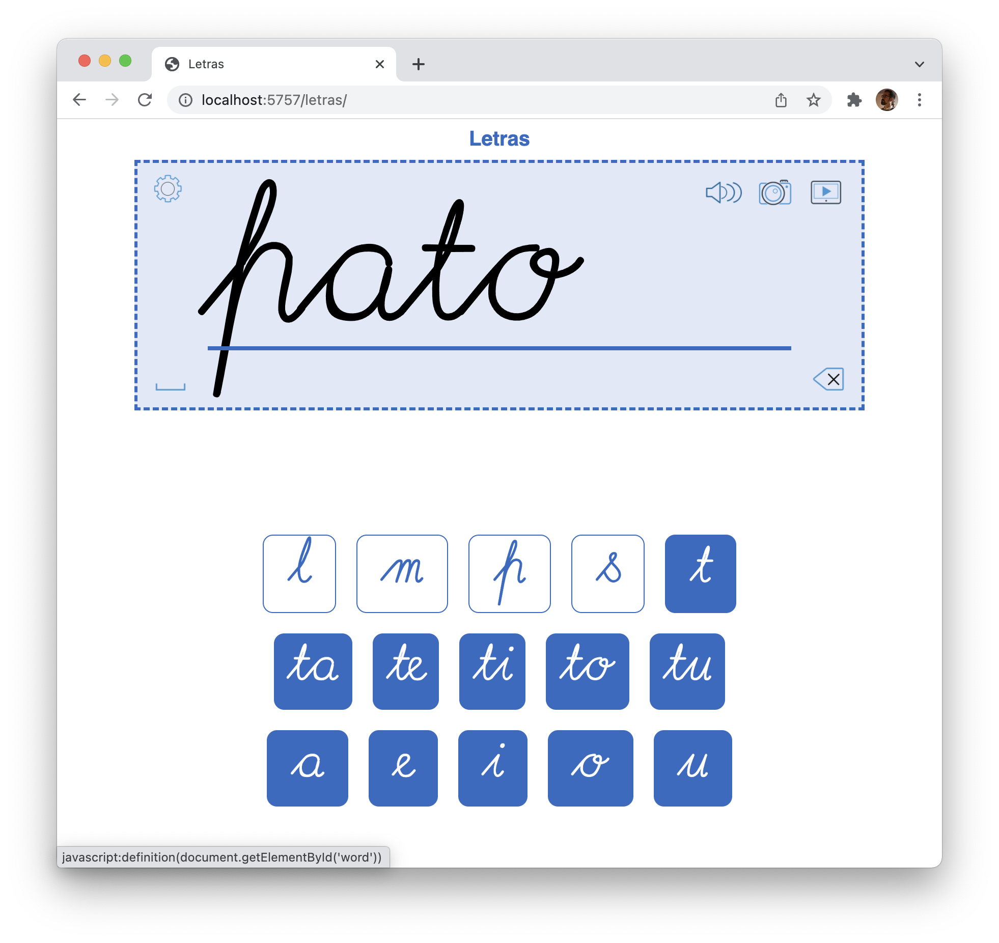

# Adapted web games
Just simple adapted web games for kids to be played on a web browser

Those games were originally meant to be tested and evolved in a joint project with the department of technical help and occupational therapy of the Hospital San Rafael Special Education School, Madrid

## Setting-up
1. Clone the repo
2. Set up a webserver host with repo's root as document root, or open it up on [CodeKit](https://codekitapp.com) or similar

## Games

